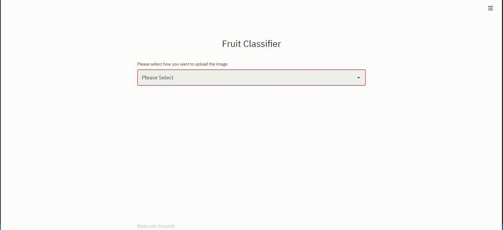

# Steps for using the Web Application
- Setting up the Python Environment with the dependencies:

        pip install streamlit
        pip install tensorflow
        pip install keras
        pip install numpy
        pip install PIL
        pip install urllib

- Cloning the Repository: 

        git clone https://github.com/indiradutta/Fruit-Classification-using-Keras.git
- Entering The directory: 

        cd Fruit-Classification-using-Keras
- Running the Web App:

        streamlit run app.py
- Stopping the web app from the terminal:
 
        Ctrl+C

# Demonstration
 

Here's a demonstration video of the Web App!!
 
 

